# Campus Connect

> Një aplikacion modern mobil i ndërtuar me **React Native + Expo** për të mbajtur studentët e universitetit të lidhur. Zbulo ngjarjet në kampus, raporto sendet e humbura ose të gjetura, postoni pyetje dhe menaxhoni jetën tuaj personale në kampus nga një vend i vetëm.

---

## Overview

**Campus Connect** është dizajnuar për studentët që të ndërveprojnë, të ndajnë informacion dhe të jenë të informuar për gjithçka që ndodh në kampus.  
Aplikacioni integron **zbulimin e ngjarjeve**, **menaxhimin e sendave të humbura dhe të gjetura**, **pyetje & përgjigje** dhe **personalizimin e profilit** - të gjitha brenda një ndërfaqeje miqësore dhe të qëndrueshme të ndërtuar për mobile dhe web (Expo Web).

---

## Installation & Setup
1. Clone Repozitorin:
```bash
git clone https://github.com/oltikrasniqi21/Campus_Connect_GR19.git
```
2. Navigojme ne project folder:
```bash
cd Campus_Connect_GR19
```
3. Instalojme Dependencies
```bash
npm install
```
4. Fillojme development serverin
```bash
npx expo start
```
5. Mund ta hapim aplikacionin permes disa metodave:
 - Skanojme QR Code me **Expo Go App** ne Android ose me Camera App ne IOS
 - Ctrl+Click ne http://localhost:8081 ose vendosim http://localhost:8081 ne nje web browser
 - (Opsionale) mund te perdorim IOS Simulator ose Android Emulator (shtypim i ose a per ta hapur aplikacionin)


## Features

### Home
- Shiko **ngjarjet aktuale në kampus** (me titull, datë dhe vendndodhje)  
- Kliko **Shiko më shumë** për informacion të detajuar dhe përshkrim të ngjarjes  
- Listë dinamike e ngjarjeve në zhvillim ose të ardhshme

### Lost & Found
- Shfleto të gjitha sendet e raportuara si **Humbur** ose **Gjetur**  
- Filtroni sipas statusit, shikoni detajet e gjësendit ose postoni një raport të ri  
- Butoni lëvizës **“+”** lejon akses të shpejtë në formën e postimit

### Saved Items
- Mbaj gjurmët e postimeve tuaja **të preferuara ose të rëndësishme**  
- Postimet e ruajtura shfaqen këtu  
- Lejon përdoruesit të rikthehen dhe të ndjekin përditësimet e sendeve të ruajtura  
- Organizoni postimet në dosje

### Post Item
- Krijoni dhe dorëzoni postime të reja për sendet e **Humbura** ose **Gjetura**  
- Mbushni fushat si titulli, përshkrimi, vendndodhja dhe informacion shtesë  

### Q&A
- Bëni pyetje ose jepni përgjigje për çështje të lidhura me kampusin  
- Bashkohuni në diskutime akademike ose komunitare (karakteristikë në zhvillim)

### Profile
- Menaxhoni informacionin personal, foton e profilit dhe biografinë  
- Shikoni të gjitha postimet dhe ngjarjet tuaja  
- Ndryshoni të dhënat tuaja direkt nga ekrani i profilit  
- Kliko ikonën e menusë për më shumë funksionalitete si "dalja", "të ruajturat", "ndrysho detajet e llogarisë" etj.

## Updates e reja

- **Direct Photo Upload**  
  Mundësi për të:
  - ngarkuar foto direkt nga kamera ose galeria e pajisjes  
  - përmirësuar cilësinë dhe besueshmërinë e postimeve
    
- **Local Notifications**  
  Njoftime në kohë reale për:
  - ngjarje të reja në kampus  
  - sende të gjetura që përputhen me interesat e përdoruesit  

## Foto nga aplikacionni
  <details>
  <summary><strong>Home Page</strong></summary>
   
  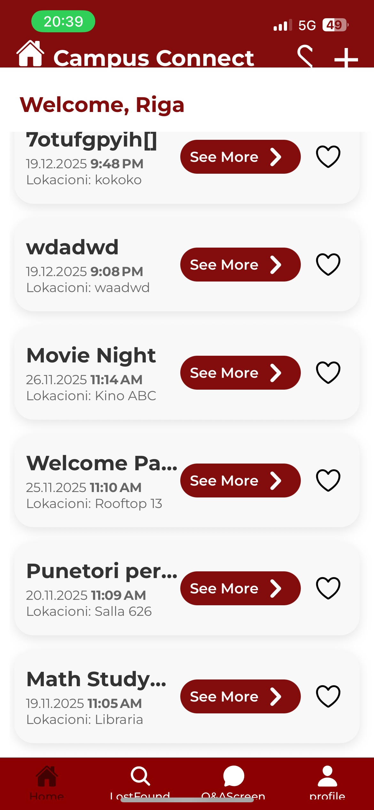
  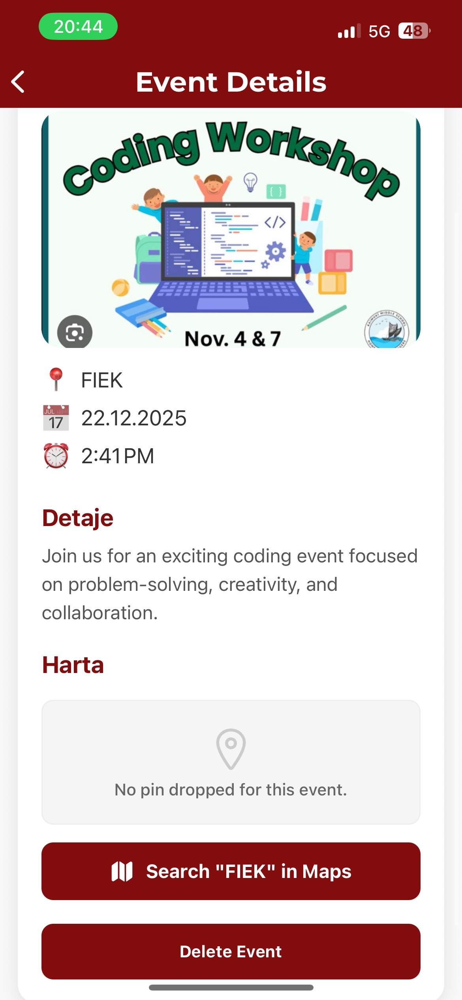
  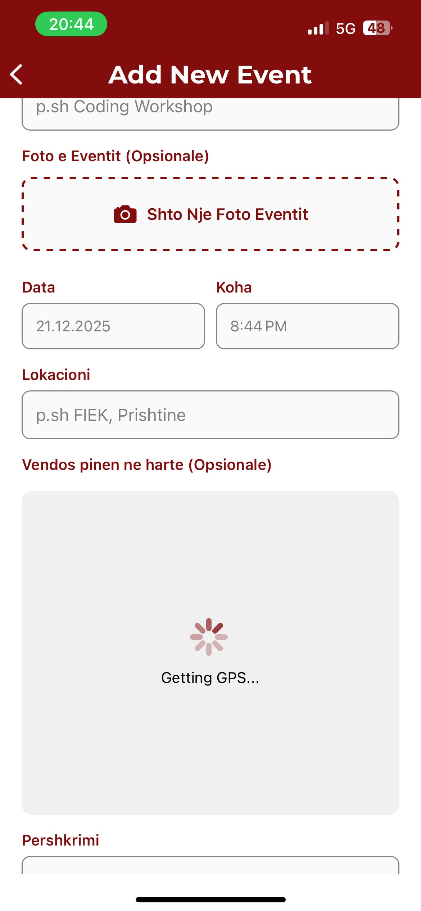
  
  </details>

  <details>
  <summary><strong>Lost & Found</strong></summary>

  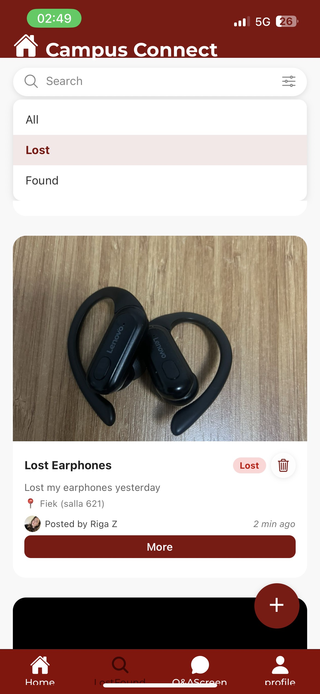
  
  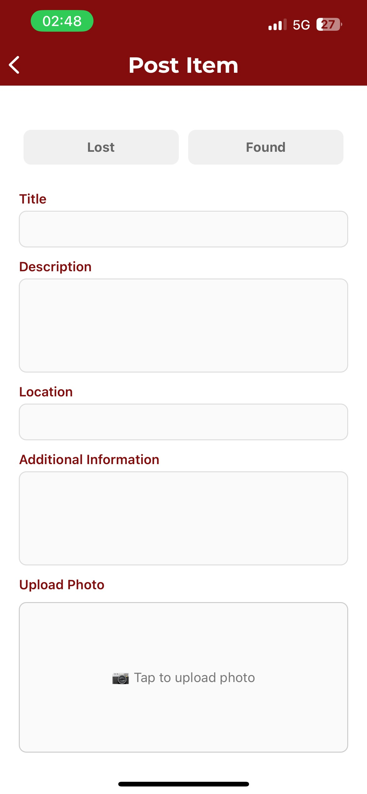
  
  </details>

   <details>
  <summary><strong>Q&A Screen</strong></summary>
   
  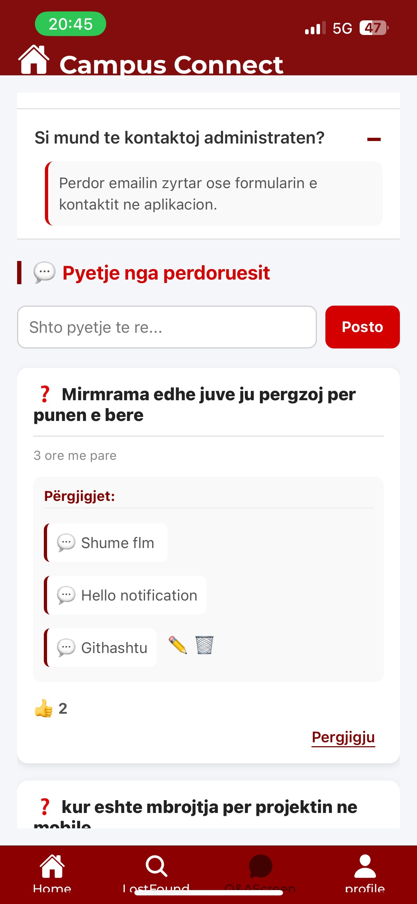
  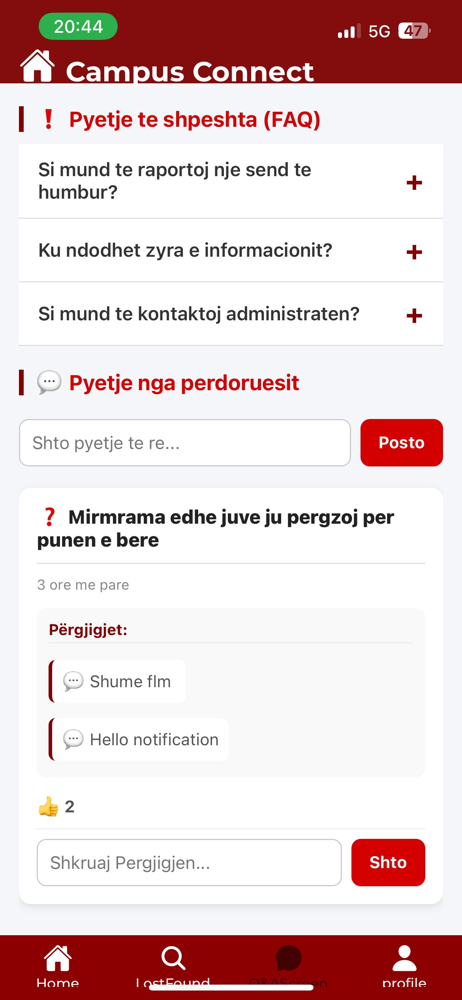

  </details>

  <details>
  <summary><strong>Profile</strong></summary>
   
  
  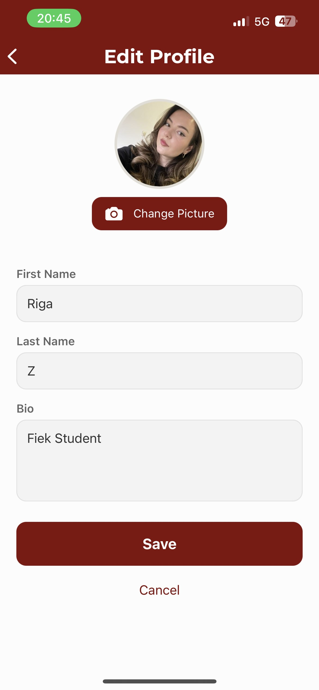
  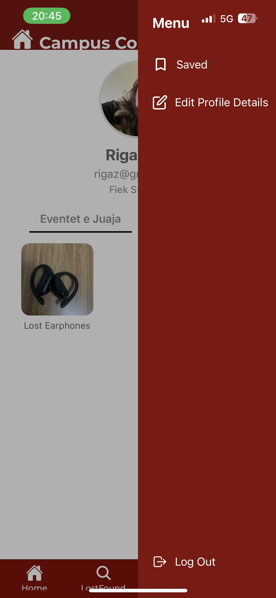
  
  </details>

   <details>
  <summary><strong>Saved Posts</strong></summary>
   
  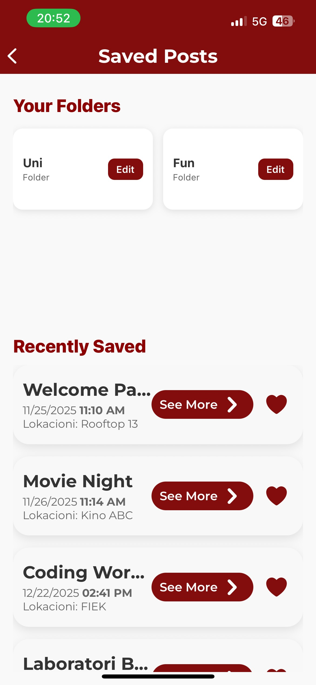
  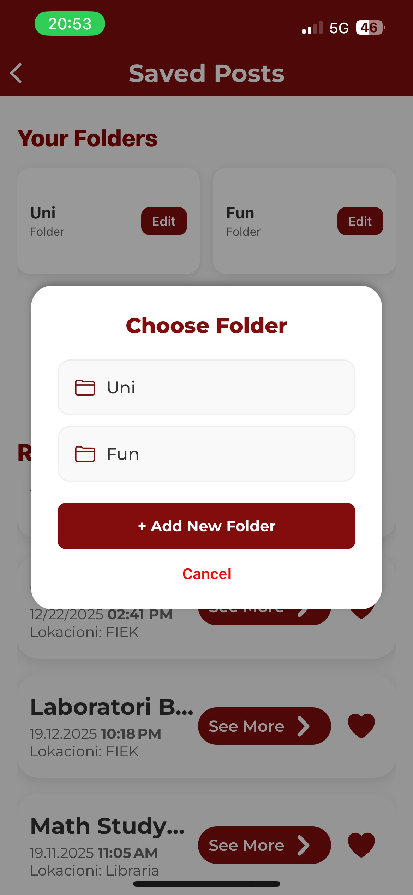

  </details>


## Antarët e grupit

- Riga Zubaku
- Rreze Ejupi
- Olti Krasniqi
- Bleron Baftiu
- Valmir Mustafa


